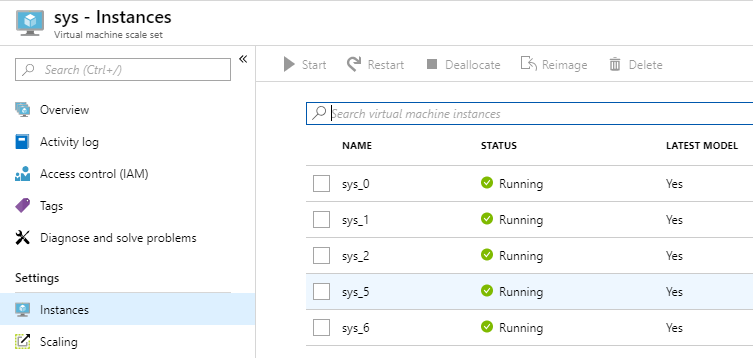
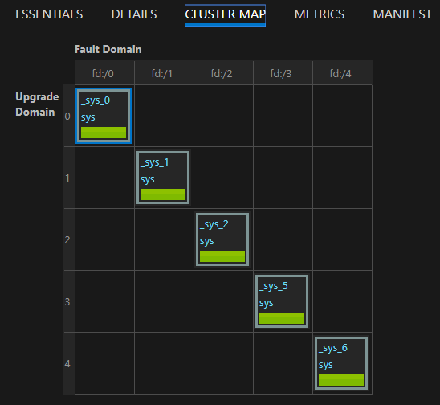
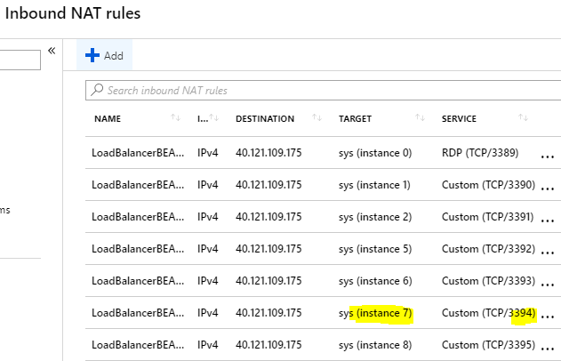
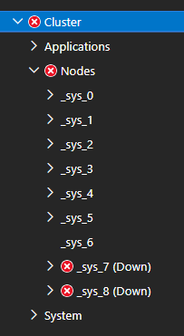
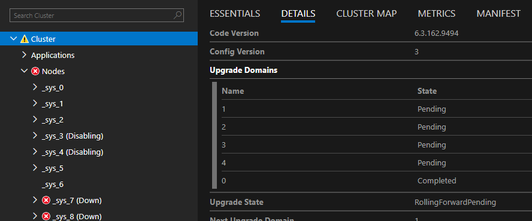
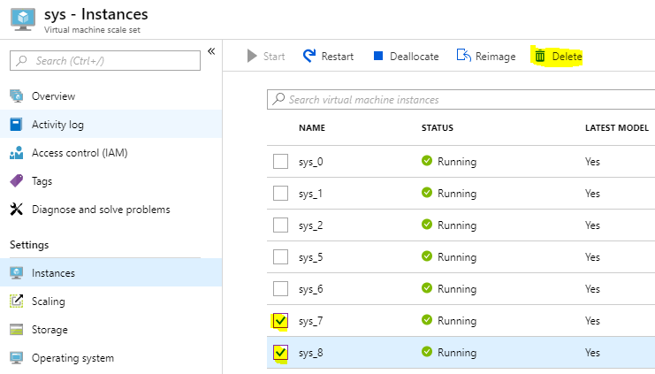
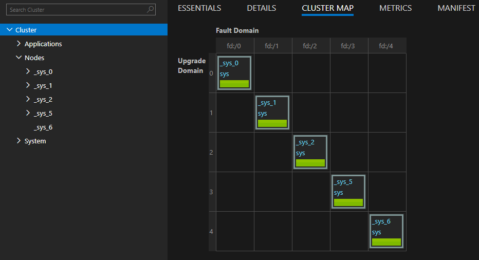

# How to recover two(2) missing seed nodes from a cluster

**Minimum requirement**: We need to have at least 3 seed nodes in a healthy state.
- We **cannot** recover the seed node one by one as if there is any of seed node missing in a cluster, the upgrade will fail with PreSafetyCheck on EnsureSeedNodeQuorum.

## **Symptoms** 

- Cluster runtime upgrades fail
- Cluster configuration upgrades will still with a presafety check on EnsureSeedNodeQuorum.
- Application upgrades fail and give "seed quorum lost" error.
- The VM in the virtual machine scale set (Instances list) with the matching Node name listed in <Infrastructure><Votes> section was deleted and the Node is no longer showing in Service Fabric Explorer 

## **Which nodes are seed nodes?**

- run **Get-ServiceFabricClusterManifest** from PowerShell and review the <Infrastructure><Votes> configuration

```PowerShell
    PS D:\Temp> Get-ServiceFabricClusterManifest
    ...
    <Infrastructure>
        <PaaS>
        <Roles>
            <Role RoleName="sys" NodeTypeRef="sys" RoleNodeCount="5" />
        </Roles>
        <Votes>
            <Vote NodeName="_sys_0" IPAddressOrFQDN="10.0.0.4" Port="1025" />
            <Vote NodeName="_sys_1" IPAddressOrFQDN="10.0.0.5" Port="1025" />
            <Vote NodeName="_sys_2" IPAddressOrFQDN="10.0.0.6" Port="1025" />
            <Vote NodeName="_sys_3" IPAddressOrFQDN="10.0.0.7" Port="1025" />
            <Vote NodeName="_sys_4" IPAddressOrFQDN="10.0.0.8" Port="1025" />
        </Votes>
        </PaaS>
    </Infrastructure>
```

As you can see in this example, there are 5 nodes configured as seed nodes, with these specific names and ip addresses. 


## **Determine which seed nodes were removed**

- Review nodes in the underlying Virtual machine scale set for the primary nodetype (sys in this example)

    - View from the Azure Portal

        

    - or via PowerShell

```PowerShell
        PS C:\temp> Get-AzureRmVmssVM -ResourceGroupName "samplegroup" -VMScaleSetName "sys"

        ResourceGroupName  Name Location            Sku Capacity InstanceID ProvisioningState
        -----------------  ---- --------            --- -------- ---------- -----------------
        SAMPLEGROUP      _sys_0   westus Standard_D1_v2                   0         Succeeded
        SAMPLEGROUP      _sys_1   westus Standard_D1_v2                   1         Succeeded
        SAMPLEGROUP      _sys_2   westus Standard_D1_v2                   2         Succeeded
        SAMPLEGROUP      _sys_5   westus Standard_D1_v2                   3         Succeeded
        SAMPLEGROUP      _sys_6   westus Standard_D1_v2                   4         Succeeded
```

- Comparing this list from the list of seed nodes you can see **two nodes** are missing, **_sys_3_** and **_sys_4**.  The nodes may have been removed intentionally or by accident through a mis-configured auto-scale configuration.

## **Steps to Repair**

1.  Determine which Fault Domain (FD) and Upgrade Domain (UD) the missing seed nodes came from, e.g. from the cluster map in SFX. In this example node _sys_3 and _sys_4 had been removed at some point and were replaced with _sys_5 and _sys_6 respectively, however neither _sys_5 or _sys_6 are currently configured as seed nodes.  All our seed nodes should be evenly distributed across UD and FD boundaries, so we will conclude the missing nodes were from UD3/FD3 and UD4/FD4.

    


2.  Increase the VMSS instance count by +2, for this example from 5 to 7 

    - This can be done 
        - From <https://resources.azure.com>
        - From Azure Portal -> Resource Group -> Scaling
        - From PowerShell - https://docs.microsoft.com/en-us/azure/virtual-machine-scale-sets/virtual-machine-scale-sets-manage-powershell#change-the-capacity-of-a-scale-set

    - In our example we will assume these new nodes are called _sys_7 and _sys_8 


3.  RDP into the first new node instance(**_sys_7**), we will refer to this as the **Fake seed node**. 

    - You can find the IP and Port to connect to from the Load Balancer -> Inbound NAT rules

    

    - Open a PowerShell prompt and capture the IP address assigned in the vnet, for this example we will assume the Fake seed nodes IP address is 10.0.0.9

    - Stop the Azure Bootstrap Agent and FabricHost on the VMs by running (**order matters**)

```PowerShell
        net stop ServiceFabricNodeBootstrapAgent
        net stop FabricHostSvc
```


4. Disable FabricHostSvc service in Services.msc snapin, otherwise this service can be restarted by its own.


5. Create a new temporary node configuration file on the new node in the D:\temp folder.

    - copy the file "D:\SvcFab\\_sys_7\Fabric\Fabric.Data\InfrastructureManifest.xml" to "D:\temp\InfrastructureManifest.template.xml"
    
        - Replace NodeName with the original name of the first missing seednode _sys_3

        - Verify the IPAddressOrFQDN with the IP Address of the **Fake seed node** (10.0.0.9)

        - Replace the FaultDomain and UpgradeDomain with values determined in step 1, "fd:3" and "3" respecively

```xml
        <?xml version="1.0" encoding="utf-8"?>
        <InfrastructureInformation xmlns:xsd="http://www.w3.org/2001/XMLSchema" xmlns:xsi="http://www.w3.org/2001/XMLSchema-instance" xmlns="http://schemas.microsoft.com/2011/01/fabric">
            <NodeList>
                <Node NodeName="_sys_3" IPAddressOrFQDN="10.0.0.9" RoleOrTierName="sys" NodeTypeRef="sys" FaultDomain="fd:/3" UpgradeDomain="3" />
            </NodeList>
        </InfrastructureInformation>
```


6. Copy "D:\SvcFab\_sys\_7\Fabric\ClusterManifest.current.xml" to "D:\temp\newClusterManifest.xml"


7. Modify "D:\temp\newClusterManifest.xml" similar to this example to update _sys_3 with the IP of the **Fake seed node** (without the --- lines):

```xml
<Votes>
    <Vote NodeName="_sys_0" IPAddressOrFQDN="10.0.0.4" Port="1025" \>
    <Vote NodeName="_sys_1" IPAddressOrFQDN="10.0.0.5" Port="1025" \>
    <Vote NodeName="_sys_2" IPAddressOrFQDN="10.0.0.6" Port="1025" \>
    -------------------------------------------------------------------------------------------- ---
    <Vote NodeName="_sys_3" IPAddressOrFQDN="10.0.0.9" Port="1025" \>
    -------------------------------------------------------------------------------------------- ---
    <Vote NodeName="_sys_4" IPAddressOrFQDN="10.0.0.8" Port="1025" \>
</Votes>
```

Save the file


8. Open PowerShell with local admin and run the following PS cmdlet to make the **Fake seed node** function as our original seed node _sys_3

```PowerShell
    New-ServiceFabricNodeConfiguration -ClusterManifestPath "D:\temp\newClusterManifest.xml" -InfrastructureManifestPath "D:\temp\InfrastructureManifest.template.xml"
```


9.  Delete D:\SvcFab\\_sys_7 folder

    - This step is important to allow our **Fake seed node** to assume the identity of _sys_3


10. Re-enable the stopped FabricHostSvc service

    - Do not forget to **enable** FabricHostSvc if you disabled it in step 4

```PowerShell
        net start FabricHostSvc
```


11. Watch the d:\SvcFab folder, one the FabricHostSvc starts again you should see a new folder get created with the original seed nodes name d:\SvcFab\\_sys_3.

    - If you do not see this happen, or you see the folder _sys_7 get recreated then something didn't work.  Double check your work and return to step 3 and try again.

12. Now you can restart ServiceFabricNodeBootstrapAgent

```PowerShell
        net start ServiceFabricNodeBootstrapAgent
```


13. Open task manager, and switch to the details tab.  Within a few minutes you should see **FabricGateway.exe** started up

    - Once this step is done, you will should see **_sys_3** has returned in SFX and is identified as a **seed node = true** on the Node -> Essential view. 

        **Note:** if node _sys_3 is showing Disabled you should be able to Activate from SFX


14. Now **repeat steps 3 through 13** to reconfigure _sys_8 to a Fake seed node for _sys_4.

    - When complete the cluster should look like this

    


15. _sys_7 and _sys_8 will now be shown in a down state(Error) - this is expected

    - By changing the _sys_7 VMMS instance into being recognized in SF as _sys_3, we have created an inconsistency we now need to cleanup by removing the **Fake seed node** _sys_3.  The Virtual machine scale set still identifies this node as _sys_7 and the Service Fabric Resource Provider thinks it is _sys_3).
    - By changing the _sys_8 VMMS instance into being recognized in SF as _sys_4, we have created an inconsistency we now need to cleanup by removing the **Fake seed node** _sys_4.  The Virtual machine scale set still identifies this node as _sys_8 and the Service Fabric Resource Provider thinks it is _sys_4).

        - If these cleanup steps are not done then any future VMSS reimage operations to either _sys_7 or _sys_8 VMSS instances, they will be reset back to their original state in the Service Fabric cluster, again causing the cluster to have missing seed node(s).


16. From a different machine (such as your Dev Machine) remove the two extra nodes and the two **Fake seed node(s)**

```PowerShell
    Connect-ServiceFabricCluster -ConnectionEndpoint ...
    Disable-ServiceFabricNode -NodeName _sys_7 -Intent RemoveNode -Force
    Disable-ServiceFabricNode -NodeName _sys_8 -Intent RemoveNode -Force
    Disable-ServiceFabricNode -NodeName _sys_3 -Intent RemoveNode -Force
    Disable-ServiceFabricNode -NodeName _sys_4 -Intent RemoveNode -Force
```
- Disabling _sys_3 and _sys_4 with the RemoveNode intent will cause a series of cluster upgrades to start, which will attempt to move the **seed node** status from _sys_3 and _sys_4 and apply this status to other existing nodes.  In our example the best candidates (nodes not already seed nodes) will be the only possible nodes left which are _sys_5 and _sys_6.

    - You will see the _sys_3 and _sys_4 node status in Disab[**ling**] state for some time while the upgrades go through, you must wait patiently until the Status is "**Disabled**"
    - Call Get-ServiceFabricClusterUpgrade to check the progress

    


17. Once _sys_3 and _sys_4 are disabled, you can reduce the VMSS instance count by 2 from the Azure Portal to remove the two VM's we temporarily added (_sys_7 & _sys_8)

    - This can be done 
        - From <https://resources.azure.com>
        - From Azure Portal -> Resource Group -> Scaling
        - From PowerShell - https://docs.microsoft.com/en-us/azure/virtual-machine-scale-sets/virtual-machine-scale-sets-manage-powershell#change-the-capacity-of-a-scale-set
        - Azure Portal -> vmms -> instances (manually delete the nodes _sys_7 and _sys_8)

        


18. From the PowerShell window you can now remove the nodestate for all the nodes marked as (Down)

```PowerShell
    Connect-ServiceFabricCluster -ConnectionEndpoint ...
    Remove-ServiceFabricNodeState -NodeName _sys_7 -Force
    Remove-ServiceFabricNodeState -NodeName _sys_8 -Force
    Remove-ServiceFabricNodeState -NodeName _sys_3 -Force
    Remove-ServiceFabricNodeState -NodeName _sys_4 -Force
```


19. The cluster should now be healthy for _sys_0,1,2,5,6 and all should be marked as 'Is Seed Node = true'

    


## **Notes**

**Note 1** : In some cases a seed node (say _sys_1) was removed from SFX but the underlying VM Instance from the Virtual machine scale set (VMMS) was not actually deleted.  Simply rebooting this VM instance will cause  the node to reconfigure and try to rejoin the cluster automatically.

**Note 2**: In some cases a seed node (say _sys_1) was removed from the VMMS but is still showing as in SFX in a **Down** state, you can follow these step.

1.  Increase the VM instance count by 1 from <https://resources.azure.com>

2.  Disable the node - **Disable-ServiceFabricNode -NodeName _sys_1 -Intent RemoveNode**  (This will trigger a complete UD walk)

3. Wait for the Cluster Upgrade to complete
    - you can verify the cluster status by calling **Get-ServiceFabricClusterUpgrade**

4.  Remove the down node by calling 'Remove-ServiceFabricNodeState -NodeName _sys_1'

