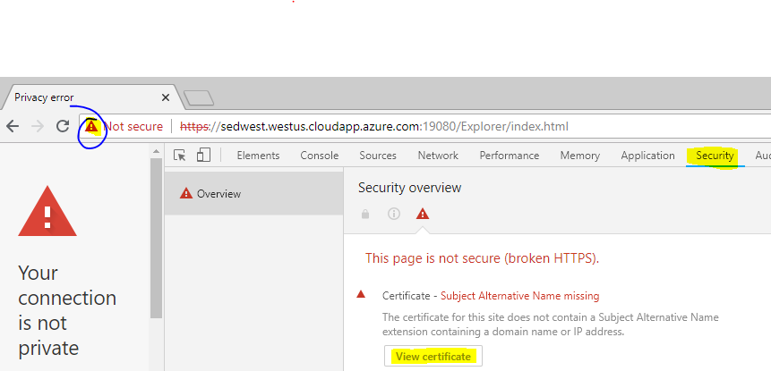

## How to view the Cluster certificate from the Browser

When working with customers using secure clusters it can often be useful to see the certificate they are using to secure their clusters (ie. to make sure it has Server+Client authentication, or to check the subject name).  There are two ways to do this

Normally you can view the cert in whatever web browser you are using.  Click the security icon next to the URL and then click Details and view the certificate:



If the web browser does not allow you to view the certificate you can run the following Powershell to save the .cer file:

```PowerShell
	$URL = "https://sedwest.westus.cloudapp.azure.com:19080/Explorer"
	$output = (New-TemporaryFile).FullName + ".cer"
	
	$webRequest = [Net.WebRequest]::Create($URL)
	try { $webRequest.GetResponse() } catch {}
	$cert = $webRequest.ServicePoint.Certificate
	$bytes = $cert.Export([Security.Cryptography.X509Certificates.X509ContentType]::Cert)
	Set-Content -value $bytes -encoding byte -path $output
	Write-Output "Saved file to " $output
	Invoke-Item $output
```


